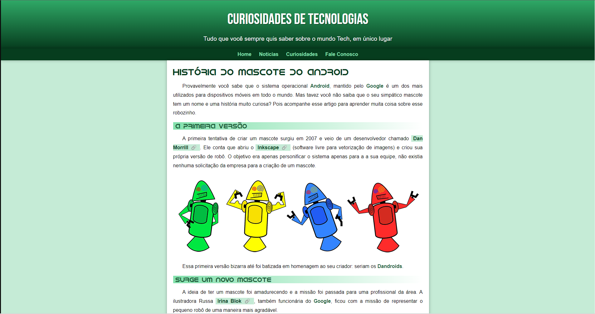

<h1 align="center"> História do Android </h1>

Projeto exclusivo e gratuito, promovido pelo "Curso em Vídeo" para ensino de tecnologias WEB.

  <a href="#-tecnologias">Tecnologias</a>&nbsp;&nbsp;&nbsp;|&nbsp;&nbsp;&nbsp;
  <a href="#-projeto">Projeto</a>&nbsp;&nbsp;&nbsp;|&nbsp;&nbsp;&nbsp;
  <a href="#-responsivo">Responsivo</a>&nbsp;&nbsp;&nbsp;|&nbsp;&nbsp;&nbsp;
  <a href="#memo-licença">Licença</a>

  

 

  

## 🚀 Tecnologias

Esse projeto foi desenvolvido com as seguintes tecnologias:

- HTML e CSS
- Git e Github

## 💻 Projeto

O projeto da História do Android foi desenvolvido para ensinar as 'Tags' mais usadas no HTML5 juntamento com CSS3.

## 📱 Responsivo

Você pode visualizar o layout Responsivo através do seu Smartphone por meio do QrCode:
  

  

Ou acessá-lo [AQUI](https://tonelopes.github.io/projeto-android/)

## :memo: Licença

Esse projeto está sob a licença MIT.

---

Feito com ♥ by CursoemVideo :wave: [Apoiamos o ensino Gratuito.](https://www.cursoemvideo.com)
